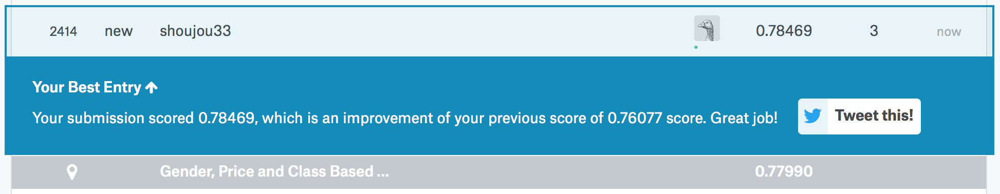

```{r setup, include=FALSE}
knitr::opts_chunk$set(echo = TRUE)
```
```{r echo=FALSE, message=FALSE}
library(rpart)
library(dplyr)
library(magrittr)
library(randomForest)
```

---

### 1 期末作業簡介
本網頁為 R 程式設計班第 278 期的期末報告，將以 [Kaggle](https://www.kaggle.com) 的 Titanic 訓練與測試進行資料整理，並使用機器學習的分類模型。

---

### 2 讀取 **titanic** 資料
使用 `read.csv()` 取得資料
```{r}
titanic <- read.csv("https://storage.googleapis.com/r_rookies/kaggle_titanic_train.csv")
```

---

### 3 簡介 **titanic** 資料
```{r}
str(titanic)
```

|變數名稱|意思解釋|備註|
|--------|--------|----|
|PassengerId|乘客ID|編號 1 2 3 4 5 ...|
|Survived|事故後是否存活|0:無存活 / 1:有存活|
|Pclass|等級|1:頭等 / 2:次等 / 3:末等|
|Name|姓名|   |
|Sex|性別|1:男性(male) / 2:女性(female)| 
|Age|年齡|   |
|SibSp|同行手足或配偶數|   |
|Parch|同行父母或子女數|   |
|Ticket|票根編號|   |
|Fare|購買票價|   |
|Cabin|客艙|   |
|Embarked|登船港埠|C: Cherbourg / Q: Queenstown / S: Southampton|

發現下表中，`Age` 變數有 177 個遺漏值，`Embarked` 有 2 個遺漏值。
```{r echo=FALSE}
summary(titanic)
```

---

### 4 觀察處理 **titanic** 資料

##### 4-1 觀察 Embarked 項目
眾數為 S，且有兩個遺漏值。
這裡選擇用眾數來填補遺漏值。
```{r}
summary(titanic$Embarked)
```

##### 4-2 用眾數填補 Embarked 遺漏值
改變 Embarked 的資料類型，從 factor 變 charater，填補完成後再改回 factor，並用 `table()` 確認填補成功。
```{r}
# 改變資料類型時，可以用 `class()` 做確認。
titanic$Embarked <- as.character(titanic$Embarked)
titanic$Embarked[titanic$Embarked == ""] <- "S"
titanic$Embarked <- as.factor(titanic$Embarked)
table(titanic$Embarked)
```

---

##### 4-3 觀察 Age 項目
有 177 個 NA 遺漏值。
```{r}
summary(titanic$Age)
```
接著找出三種等級乘客的平均年齡，用其填補遺漏值。

有遺漏值的情況下，各等級的平均年齡分別為：1st class - 38 歲 / 2nd class - 30 歲 / 3rd class - 25 歲
```{r}
summarise(group_by(titanic, Pclass), mean_age = round(mean(Age, na.rm = TRUE)))
```

##### 4-4 用平均數填補 Age 遺漏值
```{r}
filter_1 <- is.na(titanic$Age) & titanic$Pclass == 1
filter_2 <- is.na(titanic$Age) & titanic$Pclass == 2
filter_3 <- is.na(titanic$Age) & titanic$Pclass == 3
titanic[filter_1, ]$Age <- 38
titanic[filter_2, ]$Age <- 30
titanic[filter_3, ]$Age <- 25
summary(titanic$Age)
```

---

### 5 分割 **titanic** 資料樣本
先改變資料類型。
```{r}
titanic$Survived <- factor(titanic$Survived)
n <- nrow(titanic)
```
再將資料樣本洗牌成隨機狀態
```{r}
set.seed(32)
shuffled_titanic <- titanic[sample(n), ]
head(shuffled_titanic)
```
用 75/25 比例分割資料樣本為 **訓練樣本** & **測試樣本**
```{r}
train_ind <- 1:round(0.75 * n)
train <- shuffled_titanic[train_ind, ]
class(train$Pclass)
test_ind <- (round(0.75 * n) + 1):n
test <- shuffled_titanic[test_ind, ]
table(train$Pclass)
```

---

### 6 建立分類模型
使用 `randomForest` 套件，建立隨機分類模型。
```{r message=FALSE}
set.seed(32)
forest_fit <- randomForest(Survived ~ Pclass + Sex + Age + SibSp + Parch + Fare + Embarked, data = train, ntree = 200)
```
計算分類的精確度。
```{r}
prediction <- predict(forest_fit, newdata = test[, c("Pclass", "Sex", "Age", "SibSp", "Parch", "Fare", "Embarked")])
head(prediction)
confusion_matrix <- table(test$Survived, prediction)
accuracy <- sum(diag(confusion_matrix)) / sum(confusion_matrix)
accuracy
```

---

### 7 載入 **to_predict** 資料
```{r}
to_predict <- read.csv("https://storage.googleapis.com/py_ds_basic/kaggle_titanic_test.csv")
```

---

### 8 觀察處理 **to_predict** 資料
```{r}
str(to_predict)
```
發現下表中，`Age` 變數有 86 個遺漏值，`Fare` 有 1 個遺漏值。
```{r echo=FALSE}
summary(to_predict)
```

##### 8-1 觀察 Age 項目
找出三種等級乘客的平均年齡，用其填補遺漏值。

有遺漏值的情況下，各等級的平均年齡分別為：1st class - 41 歲 / 2nd class - 29 歲 / 3rd class - 24 歲
```{r}
to_predict$Pclass <- factor(to_predict$Pclass)
summarise(group_by(to_predict, Pclass), mean_age = round(mean(Age, na.rm = TRUE)))
```

##### 8-2 用平均數填補 Age 遺漏值
```{r}
filter_1 <- is.na(to_predict$Age) & to_predict$Pclass == 1
filter_2 <- is.na(to_predict$Age) & to_predict$Pclass == 2
filter_3 <- is.na(to_predict$Age) & to_predict$Pclass == 3
to_predict[filter_1, ]$Age <- 41
to_predict[filter_2, ]$Age <- 29
to_predict[filter_3, ]$Age <- 24
summary(to_predict$Age)
```

---

##### 8-3 觀察 Fare 項目
找出其項目之平均數以填補遺漏值。
```{r}
fare_mean <- mean(to_predict$Fare, na.rm = TRUE)
fare_mean
```

##### 8-4 用平均數填補 Fare 遺漏值
```{r}
to_predict$Fare[is.na(to_predict$Fare)] <- fare_mean
summary(to_predict$Fare)
```

---

### 9 預測資料
```{r}
summary(to_predict)
class(to_predict$Pclass)
```

```{r}
table(to_predict$Pclass)
to_predict$Pclass <- as.integer(to_predict$Pclass)
predicted <- predict(forest_fit, newdata = to_predict[, c("Pclass", "Sex", "Age", "SibSp", "Parch", "Fare", "Embarked")])
to_submit <- data.frame(to_predict[, "PassengerId"], predicted)
names(to_submit) <- c("PassengerId", "Survived")
```

##### 9-1 檢視預測資料
```{r}
head(to_submit, n = 10)
```

##### 9-2 輸出預測資料
```{r}
write.csv(to_submit, file = "to_submit.csv", row.names = FALSE)
```

---

### 10 上傳至 **Kaggle** 之成果
